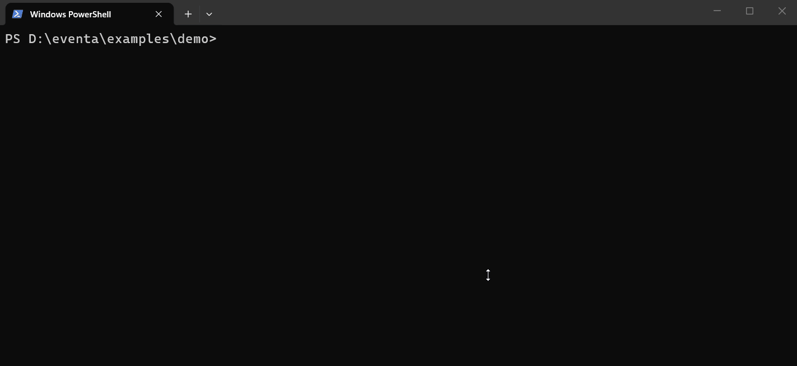

# eventa

[](https://www.npmjs.com/package/@jeeva1398/eventa)
[](https://www.npmjs.com/package/@jeeva1398/eventa)
[](https://github.com/Jeeva1398/eventa/actions/workflows/ci.yml)
[](https://huggingface.co/jeeva1398/eventa-1.5b-gguf)

[](LICENSE)

**An offline AI assistant for Node.js and TypeScript.** It explains crashes, reviews your git diff and audits dependencies, using a small fine-tuned model that runs on your laptop. No API key, and your code never leaves your machine.

```bash
npx @jeeva1398/eventa explain --run "node app.js"   # run it, explain the crash
npx @jeeva1398/eventa review                        # review your staged changes
npx @jeeva1398/eventa deps                          # fix vulnerabilities, plan upgrades
```

Or install once with `npm i -g @jeeva1398/eventa`, then use the `eventa` command. Requires Node 20+.



### What it looks like

```text
$ eventa explain --run "node src/users.js"
TypeError: Cannot read properties of undefined (reading 'name')
Looking at src/users.js:5, src/users.js:9

Cause: `user` is found for id 2 but that record has no `profile`, so `user.profile`
is `undefined` and reading `.name` on it throws.
Fix:   return (user?.profile?.name ?? '')?.toUpperCase();
```

```text
$ eventa review
▸ src/orders.js
Static checks
  [high] line 7: async-looking call without await or return, result and errors are dropped
  [high] line 8: SQL built with template interpolation, use parameters
AI review
- [high] line 7: `save()` returns a Promise that is not awaited, so failures are silently dropped → `await order.save();`
- [high] line 8: SQL injection risks for `userId` → use a parameterized statement: `db.query('SELECT * FROM users WHERE id = ?', [userId])`
```

### Why Eventa

| | Eventa | Cloud AI reviewers | `npm audit` |
|---|---|---|---|
| Works offline, no API key | ✅ | ❌ | ✅ |
| Code stays on your machine | ✅ | ❌ | ✅ |
| Explains crashes and `tsc` errors from your source | ✅ | ❌ | ❌ |
| Reviews diffs and stays quiet on clean code | ✅ (100% precision in our eval) | varies | ❌ |
| Exact fix commands + breaking-change notes | ✅ | ❌ | fix commands only |
| Cost | free | per token | free |

- **Built for Node:** Node core errors, TypeScript, Express, NestJS and Prisma.
- **Its own model:** [`eventa-1.5b`](https://huggingface.co/jeeva1398/eventa-1.5b-gguf), a Qwen2.5-Coder-1.5B fine-tune (Q4_K_M, about 1 GB) that answers in about 6 s on a laptop CPU.

## Commands

| Command | What it does |
|---|---|
| `eventa explain` | Reads an error from stdin, `--file <log>`, `--run "<cmd>"` or arguments. Parses Node stack traces and TypeScript `tsc` errors, reads the failing source lines, and explains the cause and fix. Knows Node, Express, NestJS and Prisma error codes. |
| `eventa review` | Reviews `git diff --staged` (or unstaged changes, or `--base main`) file by file. Static checks (missing await, injection, sync fs, empty catch…) guide the model. |
| `eventa deps` | Runs `npm audit` and `npm outdated` and scans imports for unused or missing packages. Prints a deterministic action plan: exact fix commands, verified breaking-change notes for major upgrades (Express, NestJS, Prisma, Mongoose, Jest, ESLint, …) and cleanup commands. `--ai` adds optional model commentary. |
| `eventa ask <question>` | Ask any Node.js question. |
| `eventa doctor` | Checks Node, Ollama and the model. |
| `eventa config get\|set\|path` | Settings in `~/.eventa/config.json` (`model`, `ollamaHost`, `temperature`, `contextSize`). |

Global flags: `-m, --model <name>`, `-p, --provider auto|ollama|local`, `--host <url>`, `--raw`. `explain`, `review` and `deps` also take `--json` for CI, and `review` takes `--markdown` and `--fail-on <severity>`.

## Review pull requests in GitHub Actions

Eventa can review every pull request and post the findings as one comment, which it updates on each push. The model runs on the GitHub runner, so your code is not sent to any AI service.

```yaml
# .github/workflows/eventa.yml
name: eventa
on: pull_request
permissions:
  contents: read
  pull-requests: write
jobs:
  review:
    runs-on: ubuntu-latest
    steps:
      - uses: actions/checkout@v4
        with:
          fetch-depth: 2
      - uses: Jeeva1398/eventa@v0.2.0
        with:
          fail-on: none   # or high | medium | low to fail the check
```

| Input | Default | |
|---|---|---|
| `fail-on` | `none` | Fail the job when the AI reports an issue at this severity or above. |
| `max-files` | `20` | Maximum number of files to review. |
| `base` | PR base | Git ref to diff against. |
| `comment` | `true` | Post or update the PR comment. The report is always written to the job summary. |
| `version` | the action's tag | `@jeeva1398/eventa` version to run. |

The first run downloads the runtime and model (~1 GB). Later runs restore them from the Actions cache. Reviews run at temperature 0, so re-running a job gives the same result. Pull requests from forks get a read-only token, so for those the report goes only to the job summary.

Locally, `eventa review --markdown` prints the same report, and `--fail-on high` sets exit code 1 when the review finds a high-severity issue.

## How the model runs

With `provider: auto` (the default), Eventa uses Ollama if it is running and has the model. Otherwise it uses the **built-in runtime**:

- On first use it installs `node-llama-cpp` with only the CPU binary for your platform (~80 MB) into `~/.eventa/runtime`. It then downloads the GGUF model (~1 GB, SHA-256 verified, resumable) into `~/.eventa/models`.
- After that, everything runs offline. Use `eventa model list | pull | use | rm` to manage models.

## Privacy & security

Your code stays on your machine. Eventa sends it only to the model running locally: the built-in runtime, or Ollama.

### What Eventa reads

Eventa never uploads your project. Each command reads only what it needs, and sends it to the model running on your machine:

| Command | Reads | Sent to the model |
|---|---|---|
| `explain` | The error you give it, and about 30 lines around up to 3 stack-trace lines in your project (never `node_modules` or files outside the project) | The error, those lines, your Node version and dependency names |
| `review` | Only the `git diff` (staged, unstaged, or since `--base`) | The changed lines with 3 lines of context |
| `deps` | `package.json`, and your source files only to collect `import`/`require` package names | Package names, versions and advisory titles, and only with `--ai`. Never code. |
| `ask` | Nothing | Your question |

Eventa stores no prompts, answers or logs, and has no telemetry or analytics. The only files it writes are the config, runtime and models in `~/.eventa`.

If you point `ollamaHost` (or `OLLAMA_HOST`) at another machine, your code is sent there, and Eventa prints a warning each time. To guarantee that nothing leaves the machine, run `eventa config set provider local`.

### Network calls

| When | Where | What is sent |
|---|---|---|
| First local use | npm registry | Downloads the runtime from a **pinned lockfile** with integrity hashes and **install scripts disabled** |
| First local use | huggingface.co | Downloads the model from a pinned commit and verifies its **SHA-256** |
| `eventa deps` | npm registry | Runs `npm audit` / `npm outdated`, which send your dependency names and versions (exactly as running them yourself would) |

**Safeguards:** AI output has terminal control sequences stripped and is never executed, and `--run` executes only the command you type. The npm package is published with provenance from GitHub Actions.

Report vulnerabilities privately: https://github.com/Jeeva1398/eventa/security/advisories/new

## FAQ & troubleshooting

**How much disk space does it need?**
About 1 GB in `~/.eventa`: the runtime (~80 MB) and the model (~940 MB). Both are downloaded on the first AI command, not at `npm install`. `eventa deps` (without `--ai`), `config` and `--help` download nothing. If you use Ollama instead, Eventa downloads neither; Ollama stores the model itself.

**How much memory, and do I need a GPU?**
No GPU is needed. The model runs on the CPU (Apple Silicon Macs also use Metal) and needs roughly 1.5–2 GB of free memory while it answers. Expect about 6 seconds per answer on a laptop CPU. `review` asks the model once per changed file.

**Which platforms are supported?**
Windows x64/arm64, macOS (Intel and Apple Silicon) and Linux x64/arm64/armv7/riscv64, all with prebuilt binaries and no compiler. On any other platform, install [Ollama](https://ollama.com) and Eventa will use it. The standalone binaries on GitHub Releases cannot install the built-in runtime, so use them with Ollama, or install the npm package.

**Can I download everything in advance, or set it up on an offline machine?**
Run `eventa model pull` once while online. After that, every command except `deps` works offline. For an air-gapped machine, copy `~/.eventa` from a machine with the same OS and CPU type, or download the `.gguf` file yourself and run `eventa model use /path/to/model.gguf`.

**I'm behind a proxy.**
The runtime is installed with npm, so it uses your npm proxy settings. The model is downloaded with Node's built-in `fetch`. On Node 24+, set `NODE_USE_ENV_PROXY=1` along with `HTTPS_PROXY`. Otherwise, download the `.gguf` yourself and run `eventa model use <path>`.

**Does it work with React, Next.js or other languages?**
It is trained for Node.js backends in JavaScript and TypeScript, including Express, NestJS and Prisma. It will still read other code, but expect weaker answers.

**I use pnpm or yarn.**
`explain`, `review` and `ask` work in any project. `deps` runs `npm audit` and `npm outdated`, so it needs a `package-lock.json`.

**The review flagged something that is fine.**
Lines under **Static checks** are quick pattern matches that guide the model, and can be wrong. The model's own findings are listed under **AI review**. `--fail-on` and the GitHub Action only count the AI findings.

**The download failed or stopped.**
Run the command again; it resumes where it stopped. If it keeps failing, delete `~/.eventa/models/*.part` and retry. `eventa doctor` shows what is installed.

**"Cannot reach Ollama" or "Unknown model".**
`-m` sets the model for both Ollama and the built-in runtime. To use an Ollama model such as `qwen2.5-coder:1.5b`, also pass `--provider ollama` and make sure `ollama serve` is running. Built-in model ids are listed by `eventa model list`.

**How do I update it?**
Run `npm i -g @jeeva1398/eventa` again. The model is downloaded again only when a new version pins a new model. You can then delete the old `.gguf` file from `~/.eventa/models`.

**How do I uninstall it?**
Run `npm uninstall -g @jeeva1398/eventa`, then delete `~/.eventa` (on Windows, `%USERPROFILE%\.eventa`) to remove the runtime and model.

## Development

Requirements: Node >= 20. [Ollama](https://ollama.com) is optional.

```bash
ollama pull qwen2.5-coder:1.5b   # optional: faster dev loop than the built-in runtime
npm install
npm run build
```

## Repo layout

```
packages/cli/   the `eventa` npm package (TypeScript)
training/       dataset builders, fine-tuning notebook, eval
```

## Releasing

- **Model:** run `training/finetune.ipynb` on a free Kaggle/Colab T4 GPU. Its last cell publishes to `huggingface.co/jeeva1398/eventa-1.5b-gguf`.
- **CLI:** bump `packages/cli/package.json`, then push a `v*` tag. GitHub Actions publishes to npm (secret `NPM_TOKEN`) and attaches standalone binaries to the GitHub Release.

## License

The CLI and training code are MIT. The `eventa-1.5b` model weights are Apache-2.0, following the base model Qwen2.5-Coder-1.5B-Instruct.
